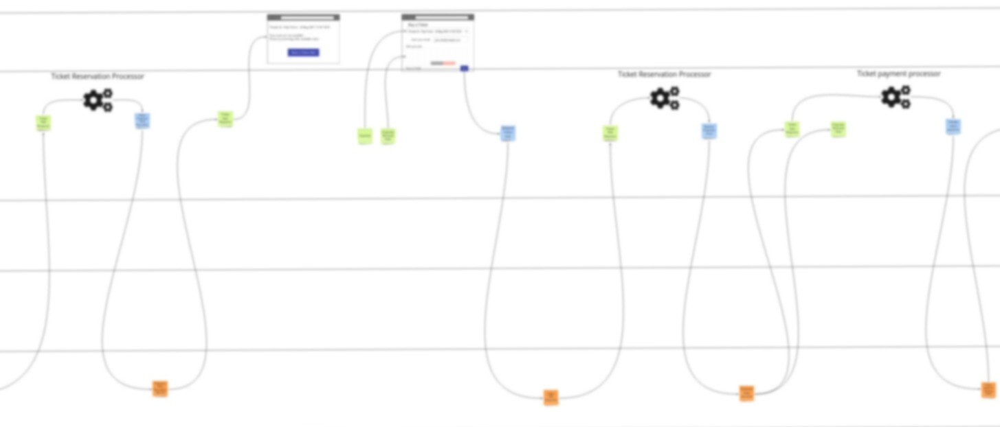

# Building Real World Event-Driven System #1: Introduction

Hello everyone. Welcome to the series in which we are going to design and implement a real-world example of an event-driven system.
We find the lack of such examples as one of the largest obstacles to the wider adoption of event-driven systems.
With this series, we hope to attract community attention, involve people in the discussion, and build a comprehensive example that would represent a useful resource on learning how to build robust, well-performing, and stable event-driven systems.

When it comes to the business domain, we have chosen to use cinema ticket sales as our example.
This particular domain has been chosen because it offers a significant amount of complexity to justify the use of an event-driven design approach and is fairly easy to understand.
To reduce the complexity and size of the solution, we chose to introduce some restrictions:
- All reservations and ticket sales are done online (no counters),
- No support for refunds through software,
- Projection duration includes a duration of a movie, commercials, and cleanup time before another projection,
- All seats cost the same.

We plan to remove these restrictions after the initial implementation and also add some additional features that are useful but not required in the original scope.
This way we will show how systems can evolve and how event sourcing enables us to perform design changes without complex migrations.

The concrete implementation approach is not yet completely defined but we do have some general guidelines defined.
We will use event modeling to design the system and event sourcing for the technical implementation.
Our experience has shown that [Event Modelling](https://eventmodeling.org/) is ideal for maintaining conceptual integrity when it comes to the development of information systems.
Solution design done with event modeling is fairly easy to reason about since it uses specification by example and only four building blocks.
With Event Modelling a person can get the feeling of how the system behaves (emitting events) depending on the given inputs (commands) by looking at one picture.
We found that [Event Sourcing](https://docs.microsoft.com/en-us/azure/architecture/patterns/event-sourcing) is a well-fitted approach for implementing event-driven systems.
Using events for communication will allow us to implement different components with different technologies.
We’ll start with a monolithic system structure that will be modular so we can split it into multiple independent components later.
That way we will show how the system can evolve in terms of the architecture over time.

All the code will be available through the public repository, and we will start with .NET and ReactJS for the tech stack.
You are encouraged to fork, create issues and pull requests against the repository.
We hope for the community to engage and help us in steering the development of this example along the way or spread the word by sharing the content with others.
Creating the solution with another tech stack, different implementation approaches, and features are much appreciated and welcomed.

We hope you will join us on this path of discovery and learning.
The next blog post in the series will focus on how we did the initial design of the system using event modeling techniques.

Until next time,
[@culaja](https://twitter.com/culaja), [@rmilovic90](https://twitter.com/RMilovic90), [@the_milenkara](https://twitter.com/the_milenkara)
